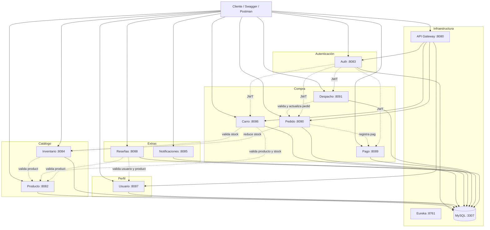

# Guía de presentación — Ecommerce Microservicios

Documento orientado a la defensa del proyecto. Explica cómo probar los microservicios con **Swagger**, cómo funcionan los **tests unitarios** y cómo se relacionan los servicios entre sí.

**Integrantes:** Vicente Rodriguez · Alessandro Nava · Bruno Decinti

---

## 1. Visión general del proyecto

Sistema de ecommerce construido con **Spring Boot** y **Java 21**, organizado en microservicios independientes. Cada servicio tiene:

- Su propia **base de datos MySQL**
- Migraciones con **Flyway**
- Documentación interactiva con **Swagger (SpringDoc OpenAPI)**
- Registro en **Eureka** (descubrimiento de servicios)
- Acceso externo parcial vía **API Gateway** (puerto 8080)

### Infraestructura principal

| Componente        | Puerto | URL / Uso                                      |
|-------------------|--------|------------------------------------------------|
| MySQL             | 3307   | Base de datos compartida (esquemas separados)  |
| Eureka Server     | 8761   | http://localhost:8761                          |
| API Gateway       | 8080   | Punto de entrada para algunas rutas            |
| Microservicios    | 8082–8091 | Swagger y API directa en cada puerto        |

### Levantar todo el sistema

Desde la raíz del proyecto:

```powershell
docker compose up --build
```

Espera a que todos los contenedores estén en estado `healthy` o `started`. Flyway crea tablas e inserta datos de ejemplo automáticamente.

---

## 2. Arquitectura y flujo entre microservicios

### Mapa de servicios



### Tabla de microservicios

| # | Servicio            | Puerto | Base de datos     | Rol principal                                      |
|---|---------------------|--------|-------------------|----------------------------------------------------|
| 1 | Auth                | 8083   | db_usuario        | Login y emisión de token JWT                       |
| 2 | Producto            | 8082   | db_producto       | CRUD del catálogo                                  |
| 3 | Inventario          | 8084   | db_inventario     | Control de stock por producto                      |
| 4 | Notificaciones      | 8085   | db_notificacion   | Registro de notificaciones                         |
| 5 | Carro               | 8086   | db_carrito        | Carrito de compras                                 |
| 6 | Usuario (perfil)    | 8087   | db_perfil         | Perfil de usuarios del ecommerce                   |
| 7 | Reseñas (review)    | 8088   | db_resena         | Reseñas y calificaciones                           |
| 8 | Pago                | 8089   | db_pago           | Registro de pagos                                  |
| 9 | Pedido              | 8090   | db_pedido         | Orquesta inventario + pago al crear pedido         |
| 10| Despacho            | 8091   | db_envio          | Envíos; valida y actualiza estado del pedido       |

### Comunicación entre servicios

Las llamadas entre microservicios usan **WebClient** (HTTP síncrono). No comparten base de datos; solo intercambian datos por API.

| Servicio origen | Llama a              | Para qué                                              |
|-----------------|----------------------|-------------------------------------------------------|
| Inventario      | Producto (8082)      | Verificar que el producto existe al crear inventario  |
| Carro           | Producto + Inventario| Validar producto y stock al agregar al carrito        |
| Pedido          | Inventario + Pago    | Reducir stock y registrar pago al crear pedido        |
| Despacho        | Pedido               | Validar pedido y cambiar su estado a DESPACHADO       |
| Reseñas         | Usuario + Producto   | Validar que usuario y producto existen                  |

### Flujo de compra (lo más importante para la demo)

```
1. Login (Auth)           → obtienes JWT
2. Ver productos          → GET Producto (público)
3. Ver stock              → GET Inventario (público)
4. Agregar al carrito     → POST Carro (requiere JWT)
5. Crear pedido           → POST Pedido (requiere JWT)
      ├─ Inventario: reduce stock
      └─ Pago: registra el pago
6. Crear despacho         → POST Despacho (requiere JWT)
      └─ Pedido: pasa a estado DESPACHADO
7. Marcar entregado       → PATCH Despacho (requiere JWT)
```

### Reglas de seguridad (JWT)

- **Auth** emite el token con usuario y rol.
- Los **GET** son públicos en la mayoría de servicios.
- Los **POST, PUT, PATCH y DELETE** requieren header `Authorization: Bearer <token>`.
- El token dura **1 hora** (`jwt.expiration=3600000`).
- Todos los servicios comparten la misma clave JWT (`jwt.secret`).

### Usuarios de prueba

**Para login (Auth — db_usuario):**

| Usuario  | Password |
|----------|----------|
| admin    | 1234     |
| usuario  | 1234     |

**Perfil Usuario (db_perfil — servicio distinto):**

| Usuario | Email               |
|---------|---------------------|
| vicente | vicente@example.com |
| maria   | maria@example.com   |

**Datos precargados (Flyway):** 5 productos, inventario asociado, reseñas, notificaciones y registros de ejemplo en varias tablas.

---

## 3. Guía Swagger — Probar los microservicios

> **Esta es la sección principal para la presentación.** Swagger muestra todos los endpoints, los cuerpos JSON de ejemplo y permite ejecutar requests en vivo.

### 3.1 ¿Qué es Swagger en este proyecto?

Usamos **SpringDoc OpenAPI 3**. Cada microservicio expone una interfaz web donde puedes:

- Ver endpoints agrupados por tags (Auth, Pedido, Producto, etc.)
- Leer descripciones y códigos de respuesta documentados
- Enviar requests reales y ver la respuesta JSON

**Ruta estándar en todos los servicios:**

```
http://localhost:<PUERTO>/doc/swagger-ui.html
```

### 3.2 URLs de Swagger por microservicio

| Microservicio   | URL Swagger                                      |
|-----------------|--------------------------------------------------|
| Auth            | http://localhost:8083/doc/swagger-ui.html      |
| Producto        | http://localhost:8082/doc/swagger-ui.html      |
| Inventario      | http://localhost:8084/doc/swagger-ui.html      |
| Notificaciones  | http://localhost:8085/doc/swagger-ui.html      |
| Carro           | http://localhost:8086/doc/swagger-ui.html      |
| Usuario         | http://localhost:8087/doc/swagger-ui.html      |
| Reseñas         | http://localhost:8088/doc/swagger-ui.html      |
| Pago            | http://localhost:8089/doc/swagger-ui.html      |
| Pedido          | http://localhost:8090/doc/swagger-ui.html      |
| Despacho        | http://localhost:8091/doc/swagger-ui.html      |

> **Nota:** El API Gateway (8080) enruta tráfico de negocio, pero **Swagger se abre directo en el puerto de cada microservicio**.

### 3.3 Pasos para usar Swagger (resumen)

#### Paso 1 — Levantar el proyecto

```powershell
docker compose up --build
```

#### Paso 2 — Obtener el token JWT

1. Abre **Auth**: http://localhost:8083/doc/swagger-ui.html
2. Expande **Autentificacion → POST /api/v1/auth/login**
3. Clic en **Try it out**
4. Usa el body de ejemplo:

```json
{
  "username": "admin",
  "password": "1234"
}
```

5. Clic en **Execute**
6. Copia el valor de `"token"` de la respuesta (solo el texto del token, sin comillas)

#### Paso 3 — Autorizar en otro microservicio

1. Abre el Swagger del servicio que quieras probar (ej. Pedido en `:8090`)
2. Arriba a la derecha, clic en **Authorize** (candado)
3. Pega **solo el token** (sin escribir `Bearer`)
4. Clic en **Authorize** → **Close**

A partir de ahí, los endpoints protegidos enviarán el JWT automáticamente.

#### Paso 4 — Ejecutar un endpoint

1. Elige el endpoint (ej. `POST /api/v1/pedidos`)
2. **Try it out**
3. Completa o edita el body JSON
4. **Execute**
5. Revisa **Response body** (código 200/201 = éxito)

### 3.4 Elementos de la interfaz Swagger

| Elemento              | Para qué sirve                                      |
|-----------------------|-----------------------------------------------------|
| Tags (grupos)         | Agrupan endpoints por módulo (Pedido, Carro…)       |
| Método + ruta         | GET = consulta, POST = crear, PATCH = actualizar    |
| Try it out            | Habilita editar parámetros y ejecutar               |
| Request body          | JSON que se envía al servidor                       |
| Responses             | Códigos documentados: 200, 404, 409, 503…           |
| Authorize (candado)   | Configura el JWT para endpoints protegidos          |
| Schemas               | Estructura de los DTOs (Request / Response)         |

### 3.5 Demo guiada en Swagger (flujo completo)

Sigue este orden en la presentación. Los datos de ejemplo ya existen en la BD gracias a Flyway.

#### A. Consultas públicas (sin token)

| Paso | Servicio   | Endpoint                              | Qué demostrar                          |
|------|------------|---------------------------------------|----------------------------------------|
| 1    | Producto   | GET `/api/v1/productos`               | Lista de 5 productos precargados       |
| 2    | Inventario | GET `/api/v1/inventario/producto/1` | Stock del producto id 1 (15 unidades)  |
| 3    | Pedido     | GET `/api/v1/pedidos`                 | Pedidos existentes                     |

#### B. Operaciones con token

Primero obtén el JWT en Auth (sección 3.3, pasos 2–3).

| Paso | Servicio | Endpoint | Body de ejemplo |
|------|----------|----------|-----------------|
| 4 | Carro | POST `/carrito` | `{"usuarioId": 1, "productoId": 1, "cantidad": 2}` |
| 5 | Pedido | POST `/api/v1/pedidos` | Ver body abajo |
| 6 | Despacho | POST `/api/v1/despachos` | `{"pedidoId": 1, "direccionEntrega": "Av. Providencia 123"}` |
| 7 | Despacho | PATCH `/api/v1/despachos/{id}/estado?estado=ENTREGADO` | Sin body |

**Body para crear pedido (paso 5):**

```json
{
  "usuarioId": 1,
  "productoId": 1,
  "cantidad": 1,
  "montoTotal": 1299990.0,
  "metodoPago": "TARJETA"
}
```

**Qué explicar al profesor en el paso 5:** al crear el pedido, el servicio Pedido llama internamente a Inventario (reduce stock) y a Pago (registra el pago). Eso se ve en los logs de Docker.

#### C. Errores útiles para mostrar dominio

| Acción                              | Respuesta esperada | Significado                          |
|-------------------------------------|--------------------|--------------------------------------|
| Pedido con stock insuficiente        | 409 Conflict       | Inventario rechazó la reducción      |
| Despacho duplicado para mismo pedido | 409 Conflict       | Un pedido solo puede tener un envío  |
| Login con password incorrecta        | 403                | Auth valida credenciales             |
| Endpoint POST sin token              | 401 / 403          | JWT requerido en mutaciones          |

### 3.6 Rutas del API Gateway (opcional)

Si quieres mostrar el gateway, estas rutas están configuradas en `:8080`:

| Ruta Gateway              | Microservicio destino |
|---------------------------|-----------------------|
| `/api/v1/auth/**`         | Auth                  |
| `/api/usuarios/**`        | Usuario               |
| `/carrito/**`             | Carro                 |
| `/api/v1/pedidos/**`      | Pedido                |

Para la demo con Swagger, usa los puertos directos (8082–8091): es más claro y muestra la documentación completa de cada servicio.

### 3.7 Verificar que los servicios están registrados

Abre Eureka: http://localhost:8761

Deberías ver registrados: AUTH-SERVICE, pedido, Carro, USUARIO, producto-service, inventario-service, etc.

---

## 4. Tests unitarios

### 4.1 ¿Para qué sirven?

Cada microservicio incluye **5 tests unitarios** sobre su capa **Service** (lógica de negocio). Sirven para:

- Verificar reglas de negocio sin levantar MySQL ni Docker
- Simular el repositorio y dependencias externas con **Mockito**
- Demostrar en la defensa que el código fue probado de forma aislada

**No son tests de integración:** no llaman a otros microservicios reales ni a la base de datos.

### 4.2 Tecnologías usadas

| Herramienta        | Uso                                              |
|--------------------|--------------------------------------------------|
| JUnit 5            | Framework de tests                               |
| Mockito            | Simula repositorios y WebClient                  |
| AssertJ            | Aserciones legibles (`assertThat`, `assertThatThrownBy`) |

### 4.3 Patrón de cada test

```java
@ExtendWith(MockitoExtension.class)
class MiServiceTest {

    @Mock
    private MiRepository repository;   // Simula la BD

    @InjectMocks
    private MiService service;           // Service real con mocks inyectados

    @Test
    void ejemplo() {
        // Given — preparar datos y comportamiento del mock
        when(repository.findById(1L)).thenReturn(Optional.of(entidad));

        // When — ejecutar el método del service
        var resultado = service.obtenerPorId(1L);

        // Then — verificar el resultado
        assertThat(resultado.getId()).isEqualTo(1L);
    }
}
```

### 4.4 Cómo ejecutar los tests

**Requisitos:** Java 17/21 y Maven en el PATH.

**Comando recomendado** (solo los 5 tests del Service, sin MySQL):

```powershell
cd <carpeta-del-microservicio>
mvn test -Dtest=NombreDelTest
```

| Microservicio    | Carpeta                      | Comando                                      |
|------------------|------------------------------|----------------------------------------------|
| Auth             | `microServicioAuth`          | `mvn test -Dtest=AuthServiceTest`            |
| Producto         | `producto`                   | `mvn test -Dtest=ProductoServiceTest`        |
| Inventario       | `microServicioInventario`    | `mvn test -Dtest=InventarioServiceTest`      |
| Notificaciones   | `microServicioNotificaciones`| `mvn test -Dtest=NotificacionServiceTest`    |
| Carro            | `Carro`                      | `mvn test -Dtest=ServiceTest`              |
| Usuario          | `Usuario`                    | `mvn test -Dtest=ServiceTest`              |
| Reseñas          | `review`                     | `mvn test -Dtest=ResenaServiceTest`          |
| Pago             | `Pago`                       | `mvn test -Dtest=PagoServiceTest`            |
| Pedido           | `Pedido`                     | `mvn test -Dtest=PedidoServiceTest`          |
| Despacho         | `Despacho`                   | `mvn test -Dtest=DespachoServiceTest`        |

**Ejecutar un solo método:**

```powershell
mvn test -Dtest=AuthServiceTest#loginExitosoDevuelveToken
```

**Desde VS Code / Cursor:** abre el archivo de test → clic en ▶ junto a la clase o al método `@Test`.

### 4.5 Resultado esperado

```
Tests run: 5, Failures: 0, Errors: 0, Skipped: 0
BUILD SUCCESS
```

### 4.6 Importante: `mvn test` sin filtro

Si ejecutas solo `mvn test`, Maven también corre clases como `LoginApplicationTests` o `PagoApplicationTests`. Esas **sí intentan conectar a MySQL** y pueden fallar aunque tus 5 tests del Service hayan pasado.

**Para la defensa, usa siempre** `mvn test -Dtest=NombreDelServiceTest`.

### 4.7 Qué decir en la defensa (ejemplo)

Para el test `loginExitosoDevuelveToken` en Auth:

1. **Given:** el repositorio devuelve el usuario `admin` y JwtService genera un token simulado.
2. **When:** llamo a `authService.login(request)`.
3. **Then:** la respuesta contiene el token `"token-jwt-123"`.

Para un test de error (ej. stock insuficiente en Pedido):

1. **Given:** el repositorio local funciona, pero la llamada a inventario fallaría (mock no configura WebClient en tests simples).
2. **When / Then:** verifico que `obtenerPorId` lanza `ResponseStatusException` cuando el pedido no existe.

### 4.8 Ubicación de los archivos

```
<microservicio>/src/test/java/.../ServiceTest/<Nombre>ServiceTest.java
```

Ejemplos:

- `microServicioAuth/src/test/java/cl/duoc/login/ServiceTest/AuthServiceTest.java`
- `Pedido/src/test/java/cl/duoc/pedido/ServiceTest/PedidoServiceTest.java`

---

## 5. Checklist rápido para la presentación

### Antes de entrar

- [ ] `docker compose up --build` terminó sin errores
- [ ] Eureka muestra los servicios en http://localhost:8761
- [ ] Swagger de Auth abre en http://localhost:8083/doc/swagger-ui.html
- [ ] Login con `admin` / `1234` devuelve token
- [ ] Al menos un `mvn test -Dtest=...ServiceTest` con BUILD SUCCESS

### Durante la demo (orden sugerido)

1. Mostrar **arquitectura** (diagrama de la sección 2)
2. Abrir **Swagger Auth** → login → copiar token
3. **GET productos** e **inventario** (públicos, sin token)
4. **Authorize** en Swagger Pedido → **POST pedido** → explicar llamadas a Inventario y Pago
5. **POST despacho** → explicar validación con Pedido
6. Mostrar **Eureka** con servicios registrados
7. Ejecutar **un test unitario** en terminal y explicar Given / When / Then

### Frases clave para el profesor

- *"Cada microservicio tiene su propia BD; se comunican solo por HTTP con WebClient."*
- *"Swagger documenta y prueba la API; SpringDoc genera la UI desde anotaciones en los controllers."*
- *"Los GET son públicos; las mutaciones requieren JWT emitido por Auth."*
- *"Los tests unitarios prueban la lógica del Service con Mockito, sin base de datos."*
- *"Pedido orquesta Inventario y Pago al crear un pedido; Despacho orquesta Pedido al enviar."*

---

## 6. Referencia técnica rápida

### Stack

- Spring Boot 3 · Spring Security · Spring Cloud (Gateway + Eureka)
- SpringDoc OpenAPI 3 (Swagger UI)
- MySQL 8 · Flyway · WebClient
- JUnit 5 · Mockito · AssertJ · Docker Compose

### Documentación OpenAPI (JSON crudo)

Disponible en cada servicio en:

```
http://localhost:<PUERTO>/v3/api-docs
```

### Configuración Swagger (application-dev.properties)

```properties
springdoc.swagger-ui.path=/doc/swagger-ui.html
springdoc.api-docs.path=/v3/api-docs
```

La clase `ConfigSwagger.java` configura el esquema **Bearer JWT** para el botón **Authorize** (candado arriba a la derecha). Sin esa configuración, Swagger no muestra dónde pegar el token aunque el backend sí lo exija en POST/PUT/PATCH/DELETE.

**Servicios con Authorize JWT:** Auth (login), Producto, Inventario, Usuario, Carro, Pedido, Pago, Despacho, Reseñas, Notificaciones.
